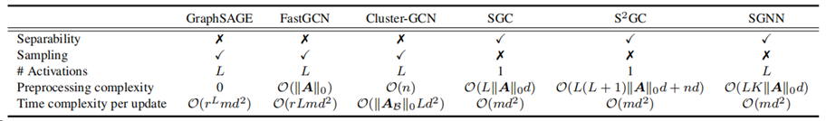

# Decouple Graph Neural Networks: Train Multiple Simple GNNs Simultaneously Instead of One

This repository is a refactored version of the implementation of 

>   Hongyuan Zhang, Yanan Zhu, and Xuelong Li,  "Decouple Graph Neural Networks: Train Multiple Simple GNNs Simultaneously Instead of One," *IEEE Transactions on Pattern Analysis and Machine Intelligence (T-PAMI)*, DOI: 10.1109/TPAMI.2024.3392782, 2024.[(arXiv)](https://arxiv.org/pdf/2304.10126.pdf)[(IEEE)](https://ieeexplore.ieee.org/document/10507024)

*SGNN* attempts to further reduce the training complexity of each iteration from $\mathcal{O}(n^2) / \mathcal{O}(|\mathcal E|)$ (vanilla GNNs without acceleration tricks, e.g., [AdaGAE](https://github.com/hyzhang98/AdaGAE)) and $\mathcal O(n)$ (e.g., [AnchorGAE](https://github.com/hyzhang98/AnchorGAE-torch)) to $\mathcal O(m)$. 

Compared with other fast GNNs, SGNN can

-   (**Exact**) compute representations exactly (without sampling);
-   (**Non-linear**) use up to $L$ non-linear activations ($L$ is the number of layers);
-   (**Fast**) be trained with the real stochastic (mini-batch based) optimization algorithms. 

The comparison is summarized in the following table. 





For inquiries original work, please contact:

hyzhang98@gmail.com


## Requirements 

```
conda create --name SGNN-geometric-new python=3.11
conda activate SGNN-geometric-new
conda install pytorch==2.2.2 torchvision==0.17.2 torchaudio==2.2.2 pytorch-cuda=12.1 -c pytorch -c nvidia
pip install torch_geometric
pip install torch-scatter torch-sparse torch-cluster torch-spline-conv -f https://data.pyg.org/whl/torch-2.2.0+cu121.htmlgeometric-new
pip install tensorflow
pip install networkx
pip install scikit-learn
pip install munkres
pip install ogb
pip install numpy==1.26.4
```


OLD
```
conda create --name SGNN-geometric-revised python=3.7
conda activate SGNN-geometric-revised
pip install tensorflow==2.1.0
pip install networkx==1.11
pip install scikit-learn==0.21.3
pip install torch==1.13.1+cu117 torchvision==0.14.1+cu117 torchaudio==0.13.1+cu117 -f https://download.pytorch.org/whl/torch_stable.html
pip install torch-scatter torch-sparse torch-cluster torch-spline-conv -f https://data.pyg.org/whl/torch-1.13.1+cu117.html
pip install torch-geometric
pip install munkres
pip install ogb 
pip install protobuf==3.20.3
```


## How to run SGNN

>   Please ensure the data is rightly loaded

Example:
```
python main.py --cuda_num=0 --data="Reddit" --model=SGNN --task="Classification" --exp=1 --log_path="local_1"
```
# SGNN Script Arguments

| Argument         | Type   | Required | Description                                                                                     |
|------------------|--------|----------|-------------------------------------------------------------------------------------------------|
| `--cuda_num`     | str    | Yes      | Specifies the GPU device to use for computation.                                               |
| `--model`        | str    | Yes      | Defines the type of model to use. Choices: `SGNN`, `SGC`, `GCN`.                               |
| `--data`         | str    | Yes      | Name of the dataset to be used in the experiment. Choices include popular graph datasets.       |
| `--task`         | str    | Yes      | Defines the type of task. Options: `classification` or `clustering`.                           |
| `--exp`          | int    | Yes      | Specifies the number of times to run the experiment for statistical validation.                |
| `--log_path`     | str    | No       | Path to store log data.                                                                        |
| `--tuning`       | int    | No       | Number of iterations for hyperparameter tuning (if applicable).                                |
| `--ddp`          | flag   | No       | Enables Distributed Data Parallelism (DDP). Default is False.                                  |
| `--mm_op`        | str    | No       | Specifies the operation for multi-model configurations. Options: `concat` or `add`.            |
| `--mm_structure` | str    | No       | Defines the multi-model structure, such as `1-2-1`, `2-2-1`, etc.                              |
| `--log_level`    | str    | No       | Sets the logging level. Choices: `info` (default) or `debug`.                                  |


# Available Datasets

| Name               | Nodes         | Edges          | Node Features | Classes |
|--------------------|---------------|----------------|---------------|---------|
| Cora               | 2,708         | 10,556         | 1,433         | 7       |
| Citeseer           | 3,327         | 9,104          | 3,703         | 6       |
| Pubmed             | 19,717        | 88,864         | 500           | 3       |
| Amazon Computers   | 13,752        | 491,722        | 767           | 10      |
| Amazon Photos      | 7,650         | 238,162        | 745           | 8       |
| Flickr             | 89,250        | 899,756        | 500           | 7       |
| LastFMAsia         | 7,624         | 55,612         | 128           | 18      |
| Actor              | 7,600         | 30,019         | 932           | 5       |
| FacebookPagePage   | 22,470        | 342,004        | 128           | 4       |
| DeezerEurope       | 28,281        | 185,504        | 128           | 2       |
| Reddit             | 232,965       | 113,615,892    | 602           | 41      |
| Arxiv              | 169,343       | 1,166,243      | 128           | 40      |
| Products           | 2,449,029     | 61,859,140     | 100           | 47      |
| Yelp               | 716,847       | 13,954,819     | 300           | 100     |
| MAG                | 736,389       | 5,416,217      | 128           | 349     |
| ogbn-proteins      | 132,534       | 39,561,252     | 8 (edge)      | 112     |
| ogbn-arxiv         | 169,343       | 1,166,243      | 128           | 40      |
| ogbn-papers100M    | 111,059,956   | 1,615,685,872  | 128           | 172     |


## How to get required data for reddit

### Classification

reddit.npz: https://drive.google.com/open?id=19SphVl_Oe8SJ1r87Hr5a6znx3nJu1F2J

reddit_adj.npz: https://drive.google.com/open?id=174vb0Ws7Vxk_QTUtxqTgDHSQ4El4qDHt

### Clustering

https://snap.stanford.edu/graphsage/reddit.zip


## Citation
```
@article{SGNN,
  author={Zhang, Hongyuan and Zhu, Yanan and Li, Xuelong},
  journal={IEEE Transactions on Pattern Analysis and Machine Intelligence}, 
  title={Decouple Graph Neural Networks: Train Multiple Simple GNNs Simultaneously Instead of One}, 
  year={2024},
  volume={},
  number={},
  pages={1-1},
  doi={10.1109/TPAMI.2024.3392782}
}
```